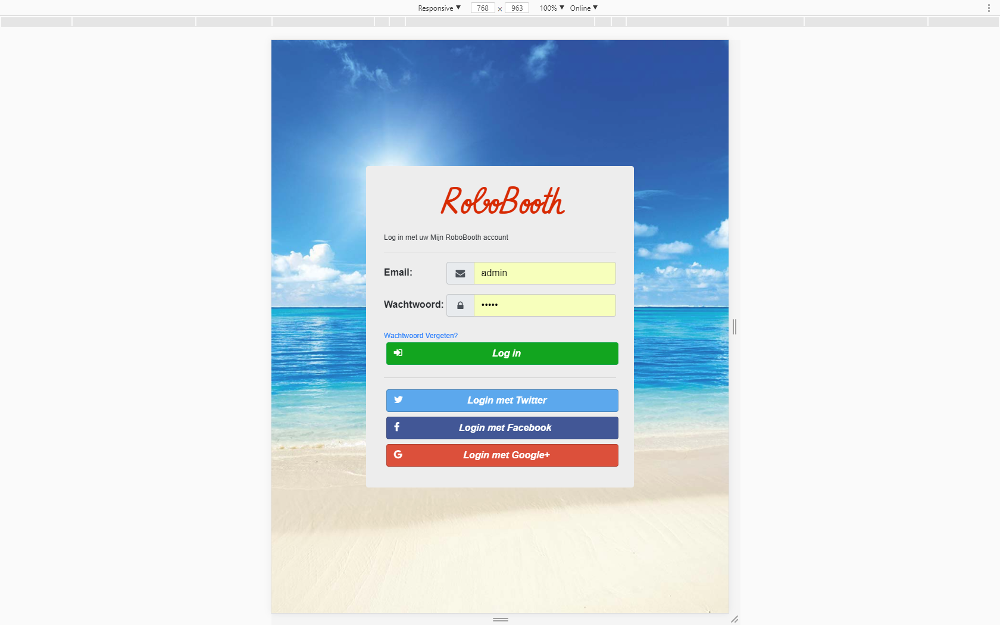

# RoboSite Documentatie

# Inhoudsopgave
* Structuur
    * [WebServer](https://gitlab.fdmci.hva.nl/RoboBooth/RoboDocs/edit/master/RoboSite%20Docs/README.md#webserver)
    * [Database](https://gitlab.fdmci.hva.nl/RoboBooth/RoboDocs/edit/master/RoboSite%20Docs/README.md#Database)
    * [Master](https://gitlab.fdmci.hva.nl/RoboBooth/RoboDocs/edit/master/RoboSite%20Docs/README.md#master)
    * [Worker](https://gitlab.fdmci.hva.nl/RoboBooth/RoboDocs/edit/master/RoboSite%20Docs/README.md#worker)
* Design
    * Login
        * [Laptop](https://gitlab.fdmci.hva.nl/RoboBooth/RoboDocs/edit/master/RoboSite%20Docs/README.md#laptop)
        * [Tablet](https://gitlab.fdmci.hva.nl/RoboBooth/RoboDocs/edit/master/RoboSite%20Docs/README.md#tablet)
        * [Telefoon](https://gitlab.fdmci.hva.nl/RoboBooth/RoboDocs/edit/master/RoboSite%20Docs/README.md#mobiel)
    * Reset
        * [Laptop](https://gitlab.fdmci.hva.nl/RoboBooth/RoboDocs/edit/master/RoboSite%20Docs/README.md#laptop-1)
        * [Tablet](https://gitlab.fdmci.hva.nl/RoboBooth/RoboDocs/edit/master/RoboSite%20Docs/README.md#tablet-1)
        * [Telefoon](https://gitlab.fdmci.hva.nl/RoboBooth/RoboDocs/edit/master/RoboSite%20Docs/README.md#mobiel-1)
    * Album
        * [Laptop](https://gitlab.fdmci.hva.nl/RoboBooth/RoboDocs/edit/master/RoboSite%20Docs/README.md#laptop-2)
        * [Tablet](https://gitlab.fdmci.hva.nl/RoboBooth/RoboDocs/edit/master/RoboSite%20Docs/README.md#tablet-2)
        * [Telefoon](https://gitlab.fdmci.hva.nl/RoboBooth/RoboDocs/edit/master/RoboSite%20Docs/README.md#mobiel-2)
    * Foto
        * [Laptop](https://gitlab.fdmci.hva.nl/RoboBooth/RoboDocs/edit/master/RoboSite%20Docs/README.md#laptop-3)
        * [Tablet](https://gitlab.fdmci.hva.nl/RoboBooth/RoboDocs/edit/master/RoboSite%20Docs/README.md#tablet-3)
        * [Telefoon](https://gitlab.fdmci.hva.nl/RoboBooth/RoboDocs/edit/master/RoboSite%20Docs/README.md#mobiel-3)
    * Account
        * [Laptop](https://gitlab.fdmci.hva.nl/RoboBooth/RoboDocs/edit/master/RoboSite%20Docs/README.md#laptop-4)
        * [Tablet](https://gitlab.fdmci.hva.nl/RoboBooth/RoboDocs/edit/master/RoboSite%20Docs/README.md#tablet-4)
        * [Telefoon](https://gitlab.fdmci.hva.nl/RoboBooth/RoboDocs/edit/master/RoboSite%20Docs/README.md#mobiel-4) 

# Structuur
## WebServer

## Database

## Master

## Worker

# Design
## Login
### Laptop

### Tablet

### Mobiel

### Reset
### Laptop

### Tablet

### Mobiel

### Album
### Laptop

### Tablet

### Mobiel

### Foto
### Laptop

### Tablet

### Mobiel

### Account
### Laptop

### Tablet

### Mobiel
